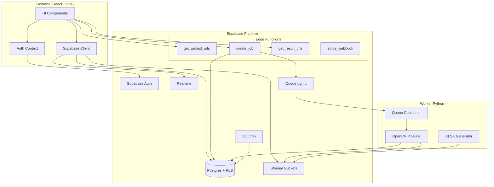
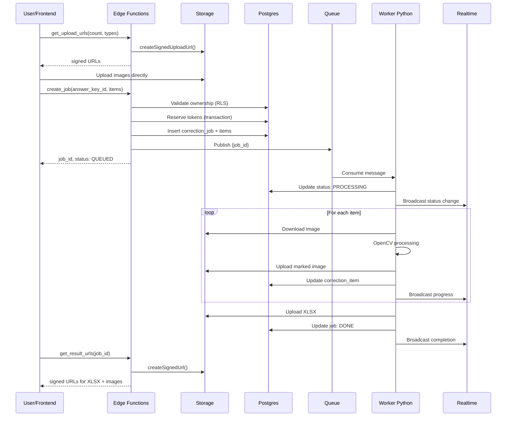
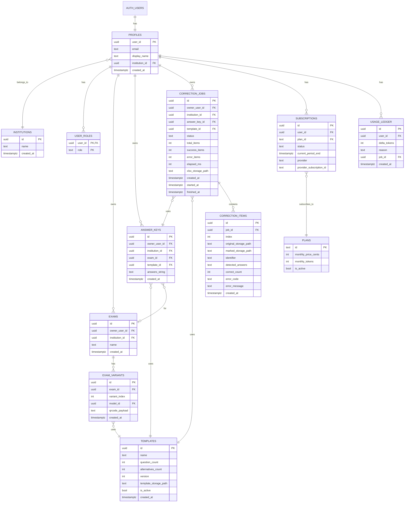
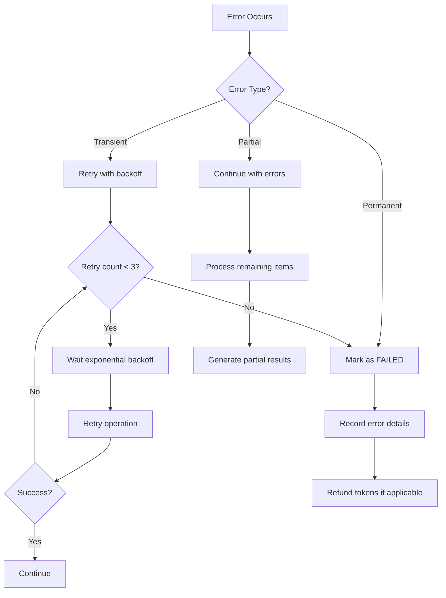

# Design Document: CorrigeProvas

## Overview

O CorrigeProvas é um sistema de correção automatizada de provas de múltipla escolha com arquitetura Supabase-first. O sistema permite que professores criem provas, definam gabaritos, façam upload de folhas de resposta digitalizadas e recebam correções automáticas com relatórios.

A arquitetura é composta por:
- **Frontend**: SPA React + Vite + shadcn/ui com integração Supabase
- **Backend**: Supabase (Auth, Postgres, Storage, Realtime, Queues, Cron) + Edge Functions
- **Worker**: Serviço Python com OpenCV para processamento de imagens

O fluxo principal é assíncrono: upload → fila → processamento → resultados via Realtime.

### UI Framework

O frontend utiliza **shadcn/ui** como biblioteca de componentes, sempre que possível. shadcn/ui é uma coleção de componentes reutilizáveis construídos com Radix UI e Tailwind CSS. Os componentes são copiados diretamente para o projeto (não é uma dependência npm), permitindo customização total.

**Componentes shadcn/ui a serem utilizados**:
- `Button`, `Input`, `Label`, `Textarea` - Formulários
- `Card`, `Dialog`, `Sheet` - Containers e modais
- `Table`, `DataTable` - Listagens
- `Select`, `Checkbox`, `RadioGroup` - Seleção
- `Progress`, `Skeleton` - Feedback de loading
- `Toast`, `Alert` - Notificações
- `Tabs`, `Accordion` - Navegação
- `DropdownMenu`, `Command` - Menus
- `Form` (react-hook-form + zod) - Validação de formulários

## Architecture



### Fluxo de Correção



## Components and Interfaces

### 1. Frontend Components

#### AuthContext
Gerencia autenticação via Supabase Auth.

```typescript
interface AuthContextValue {
  user: User | null;
  session: Session | null;
  loading: boolean;
  signIn(email: string, password: string): Promise<AuthResponse>;
  signUp(email: string, password: string): Promise<AuthResponse>;
  signOut(): Promise<void>;
  resetPassword(email: string): Promise<void>;
}
```

#### CorrectionService
Serviço para interação com Edge Functions de correção.

```typescript
interface CorrectionService {
  getUploadUrls(count: number, contentTypes: string[]): Promise<UploadUrlResponse[]>;
  createJob(params: CreateJobParams): Promise<CorrectionJob>;
  getResultUrls(jobId: string): Promise<ResultUrlsResponse>;
  subscribeToJob(jobId: string, callback: (job: CorrectionJob) => void): Subscription;
}

interface CreateJobParams {
  answerKeyId: string;
  templateId: string;
  items: { originalStoragePath: string }[];
  idempotencyKey?: string;
}

interface UploadUrlResponse {
  path: string;
  signedUrl: string;
  token: string;
}

interface ResultUrlsResponse {
  xlsxUrl: string;
  markedImageUrls: { itemId: string; url: string }[];
}
```

### 2. Edge Functions

#### get_upload_urls
Gera URLs assinadas para upload direto ao Storage.

```typescript
// Input (Zod schema)
const GetUploadUrlsInput = z.object({
  count: z.number().min(1).max(100),
  contentTypes: z.array(z.enum(['image/jpeg', 'image/png', 'image/webp'])),
  filenameHints: z.array(z.string()).optional()
});

// Output
interface GetUploadUrlsOutput {
  urls: {
    path: string;
    signedUrl: string;
    expiresAt: string;
  }[];
}
```

#### create_job
Cria job de correção, reserva tokens e publica na fila.

```typescript
// Input (Zod schema)
const CreateJobInput = z.object({
  answerKeyId: z.string().uuid(),
  templateId: z.string().uuid(),
  items: z.array(z.object({
    originalStoragePath: z.string()
  })).min(1).max(500),
  idempotencyKey: z.string().optional()
});

// Output
interface CreateJobOutput {
  jobId: string;
  status: 'QUEUED';
  totalItems: number;
  tokensReserved: number;
}
```

#### get_result_urls
Retorna URLs assinadas para download de resultados.

```typescript
// Input (Zod schema)
const GetResultUrlsInput = z.object({
  jobId: z.string().uuid()
});

// Output
interface GetResultUrlsOutput {
  xlsxUrl: string | null;
  markedImages: {
    itemId: string;
    url: string;
  }[];
  expiresAt: string;
}
```

#### stripe_webhook
Processa webhooks do Stripe para atualizar assinaturas.

```typescript
// Handled events
type StripeEventType = 
  | 'customer.subscription.created'
  | 'customer.subscription.updated'
  | 'customer.subscription.deleted'
  | 'invoice.paid'
  | 'invoice.payment_failed';
```

### 3. Worker Python

#### QueueConsumer
Consome mensagens da fila e orquestra processamento.

```python
class QueueConsumer:
    def __init__(self, supabase_url: str, service_role_key: str):
        ...
    
    def start(self) -> None:
        """Inicia loop de consumo da fila."""
        ...
    
    def process_job(self, job_id: str) -> None:
        """Processa um job completo."""
        ...
    
    def process_item(self, item: CorrectionItem, answer_key: str) -> ItemResult:
        """Processa um item individual."""
        ...
```

#### ImageProcessor (OpenCV Pipeline)
Pipeline de processamento de imagem.

```python
class ImageProcessor:
    def __init__(self, template: Template):
        ...
    
    def normalize(self, image: np.ndarray) -> np.ndarray:
        """Normaliza brilho/contraste."""
        ...
    
    def align(self, image: np.ndarray) -> np.ndarray:
        """Alinha imagem usando marcadores de referência."""
        ...
    
    def detect_marks(self, image: np.ndarray) -> list[str]:
        """Detecta marcações e retorna respostas."""
        ...
    
    def read_qr(self, image: np.ndarray) -> str | None:
        """Lê QR code se presente."""
        ...
    
    def generate_marked_image(
        self, 
        image: np.ndarray, 
        detected: list[str], 
        correct: list[str]
    ) -> np.ndarray:
        """Gera imagem com marcações de certo/errado."""
        ...
```

#### XLSXGenerator
Gera relatório Excel com resultados.

```python
class XLSXGenerator:
    def generate(
        self, 
        items: list[ProcessedItem], 
        answer_key: AnswerKey
    ) -> bytes:
        """Gera arquivo XLSX com resultados."""
        ...
```

### 4. Database Functions (SQL)

#### reserve_tokens
Reserva tokens de forma transacional.

```sql
CREATE OR REPLACE FUNCTION reserve_tokens(
    p_user_id UUID,
    p_amount INT,
    p_job_id UUID
) RETURNS BOOLEAN AS $$
DECLARE
    v_balance INT;
BEGIN
    -- Calculate current balance
    SELECT COALESCE(SUM(delta_tokens), 0) INTO v_balance
    FROM usage_ledger
    WHERE user_id = p_user_id;
    
    -- Check if sufficient
    IF v_balance < p_amount THEN
        RETURN FALSE;
    END IF;
    
    -- Debit tokens
    INSERT INTO usage_ledger (user_id, delta_tokens, reason, job_id)
    VALUES (p_user_id, -p_amount, 'CORRECTION_JOB', p_job_id);
    
    RETURN TRUE;
END;
$$ LANGUAGE plpgsql;
```

#### release_tokens
Libera tokens em caso de falha/cancelamento.

```sql
CREATE OR REPLACE FUNCTION release_tokens(
    p_job_id UUID
) RETURNS VOID AS $$
BEGIN
    INSERT INTO usage_ledger (user_id, delta_tokens, reason, job_id)
    SELECT 
        owner_user_id,
        total_items,  -- positive to credit back
        'JOB_FAILED_REFUND',
        id
    FROM correction_jobs
    WHERE id = p_job_id AND status = 'FAILED';
END;
$$ LANGUAGE plpgsql;
```

## Data Models

### Entity Relationship Diagram



### TypeScript Types

```typescript
// Enums
type JobStatus = 'QUEUED' | 'PROCESSING' | 'DONE' | 'FAILED' | 'CANCELED';
type UserRole = 'USER' | 'ADMIN' | 'INSTITUTION_ADMIN';
type SubscriptionStatus = 'ACTIVE' | 'PAST_DUE' | 'CANCELED';
type UsageReason = 'CORRECTION_JOB' | 'PLAN_RENEW' | 'JOB_FAILED_REFUND' | 'ADMIN_ADJUSTMENT';

// Core entities
interface Profile {
  userId: string;
  email: string;
  displayName: string | null;
  institutionId: string | null;
  createdAt: string;
}

interface Template {
  id: string;
  name: string;
  questionCount: number;
  alternativesCount: number;
  version: number;
  templateStoragePath: string;
  isActive: boolean;
  createdAt: string;
}

interface AnswerKey {
  id: string;
  ownerUserId: string;
  institutionId: string | null;
  examId: string | null;
  templateId: string;
  answersString: string;
  createdAt: string;
}

interface CorrectionJob {
  id: string;
  ownerUserId: string;
  institutionId: string | null;
  answerKeyId: string;
  templateId: string;
  status: JobStatus;
  totalItems: number;
  successItems: number;
  errorItems: number;
  elapsedMs: number | null;
  xlsxStoragePath: string | null;
  createdAt: string;
  startedAt: string | null;
  finishedAt: string | null;
}

interface CorrectionItem {
  id: string;
  jobId: string;
  index: number;
  originalStoragePath: string;
  markedStoragePath: string | null;
  identifier: string | null;
  detectedAnswers: string | null;
  correctCount: number | null;
  errorCode: string | null;
  errorMessage: string | null;
  createdAt: string;
}

interface Subscription {
  id: string;
  userId: string;
  planId: string;
  status: SubscriptionStatus;
  currentPeriodEnd: string;
  provider: string;
  providerSubscriptionId: string;
}

interface UsageLedgerEntry {
  id: string;
  userId: string;
  deltaTokens: number;
  reason: UsageReason;
  jobId: string | null;
  createdAt: string;
}
```

### Python Types

```python
from dataclasses import dataclass
from enum import Enum
from datetime import datetime
from typing import Optional

class JobStatus(Enum):
    QUEUED = "QUEUED"
    PROCESSING = "PROCESSING"
    DONE = "DONE"
    FAILED = "FAILED"
    CANCELED = "CANCELED"

@dataclass
class Template:
    id: str
    name: str
    question_count: int
    alternatives_count: int
    version: int
    template_storage_path: str
    is_active: bool

@dataclass
class AnswerKey:
    id: str
    owner_user_id: str
    template_id: str
    answers_string: str

@dataclass
class CorrectionItem:
    id: str
    job_id: str
    index: int
    original_storage_path: str
    marked_storage_path: Optional[str] = None
    identifier: Optional[str] = None
    detected_answers: Optional[str] = None
    correct_count: Optional[int] = None
    error_code: Optional[str] = None
    error_message: Optional[str] = None

@dataclass
class ProcessedItem:
    item_id: str
    identifier: Optional[str]
    detected_answers: str
    correct_count: int
    total_questions: int
    marked_image_path: str
    success: bool
    error_code: Optional[str] = None
    error_message: Optional[str] = None
```

### Storage Buckets Structure

```
templates/
├── modelo-10-abcd/
│   └── v1/
│       └── template.png
├── modelo-20-abcde/
│   └── v1/
│       └── template.png
└── ...

uploads/
├── {user_id}/
│   ├── {job_id}/
│   │   ├── image_001.jpg
│   │   ├── image_002.jpg
│   │   └── ...
│   └── ...
└── ...

results/
├── {user_id}/
│   ├── {job_id}/
│   │   ├── results.xlsx
│   │   ├── marked_001.jpg
│   │   ├── marked_002.jpg
│   │   └── ...
│   └── ...
└── ...

exports/
├── {user_id}/
│   ├── exam_{exam_id}.zip
│   └── ...
└── ...
```


## Correctness Properties

*A property is a characteristic or behavior that should hold true across all valid executions of a system—essentially, a formal statement about what the system should do. Properties serve as the bridge between human-readable specifications and machine-verifiable correctness guarantees.*

Based on the prework analysis, the following correctness properties have been identified. Each property is universally quantified and references the requirements it validates.

### Property 1: Authentication Session Validity

*For any* valid email/password combination, authenticating via Supabase Auth SHALL produce a valid session with user ID matching the authenticated user.

**Validates: Requirements 1.1**

### Property 2: Registration Profile Linkage

*For any* successful user registration, a profile record SHALL exist in the profiles table with user_id equal to auth.users.id and email matching the registered email.

**Validates: Requirements 1.2**

### Property 3: Role-Based Access Control

*For any* user with role ADMIN in user_roles, administrative functions SHALL be accessible; *for any* user with institution_id set, data created by that user SHALL have the same institution_id.

**Validates: Requirements 1.6, 1.7**

### Property 4: Template Constraints

*For any* template in the system:
- question_count SHALL be one of {10, 20, 50, 100}
- alternatives_count SHALL be one of {4, 5}
- template_storage_path SHALL be a non-empty string
- name, version SHALL be present
- When listing templates, only templates with is_active = true SHALL be returned

**Validates: Requirements 2.1, 2.2, 2.3, 2.4, 2.5**

### Property 5: Answer Key Validation

*For any* answer_key:
- answers_string.length SHALL equal the associated template.question_count
- Each character in answers_string SHALL be within the valid set based on template.alternatives_count (A-D for 4, A-E for 5)
- owner_user_id SHALL be non-null

**Validates: Requirements 3.1, 3.2, 3.3**

### Property 6: RLS Data Isolation

*For any* authenticated user querying data:
- Results SHALL only include records where owner_user_id = auth.uid() OR (user belongs to institution AND record.institution_id = user.institution_id)
- No user SHALL be able to access data owned by another user outside their institution

**Validates: Requirements 3.4, 11.2, 11.3**

### Property 7: Upload URL Generation

*For any* call to get_upload_urls with count N:
- Response SHALL contain exactly N signed URLs
- Each URL path SHALL follow pattern uploads/{uid}/...
- Each URL SHALL have an expiration time in the future

**Validates: Requirements 4.1, 4.2, 4.4**

### Property 8: Job Creation Invariants

*For any* successful job creation:
- correction_job.status SHALL be 'QUEUED'
- correction_items count SHALL equal input items count
- usage_ledger SHALL contain a debit entry with delta_tokens = -total_items and job_id = created job id
- A message with job_id SHALL be published to queue "corrections"
- If idempotency_key is provided and matches existing job, the existing job SHALL be returned

*For any* job creation attempt with insufficient token balance:
- Request SHALL be rejected with appropriate error
- No correction_job SHALL be created
- No tokens SHALL be debited

**Validates: Requirements 5.1, 5.2, 5.3, 5.4, 5.5, 5.6, 5.7**

### Property 9: Answer Comparison Correctness

*For any* detected_answers string and answer_key.answers_string of equal length:
- correct_count SHALL equal the number of positions where detected_answers[i] == answer_key.answers_string[i]
- This comparison SHALL be case-insensitive

**Validates: Requirements 6.5**

### Property 10: Processing Output Generation

*For any* successfully processed correction_item:
- marked_storage_path SHALL be non-null and point to a valid file in results bucket
- detected_answers SHALL be non-null with length equal to template.question_count
- correct_count SHALL be non-null and within range [0, template.question_count]

*For any* completed correction_job (all items processed):
- xlsx_storage_path SHALL be non-null and point to a valid XLSX file
- status SHALL be 'DONE'
- success_items + error_items SHALL equal total_items

*For any* failed correction_item:
- error_code SHALL be non-null
- error_message SHALL be non-null

**Validates: Requirements 6.6, 6.7, 6.8, 6.9, 6.10**

### Property 11: Result URL Authorization

*For any* call to get_result_urls:
- If job.owner_user_id != auth.uid() AND user not in same institution, request SHALL be rejected
- If job.status != 'DONE', xlsx_url SHALL be null
- All returned URLs SHALL have expiration time < 1 hour from generation

**Validates: Requirements 7.1, 7.2, 7.3, 7.4**

### Property 12: Token Ledger Consistency

*For any* user, their token balance SHALL equal SUM(delta_tokens) from usage_ledger WHERE user_id = user.id.

*For any* token debit operation:
- A usage_ledger entry SHALL be created with negative delta_tokens
- reason SHALL be non-null
- If related to a job, job_id SHALL be set

*For any* subscription renewal:
- A usage_ledger entry SHALL be created with positive delta_tokens equal to plan.monthly_tokens
- reason SHALL be 'PLAN_RENEW'

**Validates: Requirements 9.1, 9.2, 9.3, 9.4**

### Property 13: Subscription State Management

*For any* new subscription:
- status SHALL be 'ACTIVE'
- current_period_end SHALL be in the future

*For any* Stripe webhook with event_id:
- Processing the same event_id twice SHALL produce the same result (idempotency)
- Subscription status SHALL reflect the webhook event type

*For any* subscription with status 'PAST_DUE' or 'CANCELED':
- User SHALL not be able to create new correction jobs

**Validates: Requirements 10.2, 10.3, 10.4, 10.5**

### Property 14: Storage Path Enforcement

*For any* upload operation by user with uid:
- Path SHALL match pattern `uploads/{uid}/...`
- Attempts to upload to other users' paths SHALL be rejected

*For any* download operation by user with uid:
- Path SHALL match pattern `results/{uid}/...` OR be a signed URL
- Attempts to download from other users' paths SHALL be rejected

**Validates: Requirements 11.6, 11.7**

### Property 15: Exam Persistence

*For any* created exam:
- A record SHALL exist in exams table with owner_user_id = creator's uid
- For each variant, exam_variants SHALL contain variant_index, model_id
- If artifacts are saved, they SHALL exist in Storage bucket

**Validates: Requirements 12.2, 12.3, 12.4**

### Property 16: Timeout Handling

*For any* correction_job with status 'PROCESSING' for longer than timeout threshold:
- Cron job SHALL update status to 'FAILED'
- If tokens were reserved, a credit entry SHALL be added to usage_ledger with reason 'JOB_FAILED_REFUND'

**Validates: Requirements 13.2, 13.3**

### Property 17: Input Validation

*For any* Edge Function request:
- Invalid inputs (per Zod schema) SHALL be rejected with HTTP 400
- Error response SHALL contain descriptive message indicating which field(s) failed validation

*For any* job creation:
- Referenced answer_key_id SHALL exist and be owned by user
- Referenced template_id SHALL exist and be active

**Validates: Requirements 14.1, 14.2, 14.4**

## Error Handling

### Edge Function Errors

| Error Code | HTTP Status | Description | Resolution |
|------------|-------------|-------------|------------|
| VALIDATION_ERROR | 400 | Input failed Zod validation | Check request payload against schema |
| UNAUTHORIZED | 401 | Missing or invalid auth token | Re-authenticate |
| FORBIDDEN | 403 | User lacks permission for resource | Check ownership/role |
| NOT_FOUND | 404 | Referenced resource doesn't exist | Verify IDs |
| INSUFFICIENT_TOKENS | 402 | Not enough tokens for operation | Purchase more tokens |
| IDEMPOTENCY_CONFLICT | 409 | Idempotency key used with different params | Use new key or same params |
| INTERNAL_ERROR | 500 | Unexpected server error | Retry or contact support |

### Worker Processing Errors

| Error Code | Description | Recovery |
|------------|-------------|----------|
| ALIGN_TRIANGLES_NOT_FOUND | Cannot find alignment markers | Re-scan with better quality |
| QR_DECODE_FAILED | QR code unreadable | Manual identifier entry |
| MARK_DETECTION_FAILED | Cannot detect answer marks | Re-scan or manual grading |
| STORAGE_DOWNLOAD_FAILED | Cannot download source image | Retry job |
| STORAGE_UPLOAD_FAILED | Cannot upload results | Retry job |
| TEMPLATE_MISMATCH | Image doesn't match template | Verify correct template |

### Error Response Format

```typescript
interface ErrorResponse {
  error: {
    code: string;
    message: string;
    details?: Record<string, unknown>;
  };
}

// Example
{
  "error": {
    "code": "VALIDATION_ERROR",
    "message": "Invalid input",
    "details": {
      "field": "answersString",
      "issue": "Length must be 20, got 19"
    }
  }
}
```

### Retry Strategy



## Testing Strategy

### Testing Framework Selection

| Component | Framework | Rationale |
|-----------|-----------|-----------|
| Frontend (React) | Vitest + React Testing Library | Fast, modern, good DX |
| Edge Functions | Deno Test + Supabase CLI | Native Deno testing |
| Worker Python | pytest + hypothesis | Mature, property-based testing support |
| E2E | Playwright | Cross-browser, reliable |

### Frontend Stack

| Library | Purpose |
|---------|---------|
| React 19 | UI Framework |
| Vite | Build tool |
| TypeScript | Type safety |
| Tailwind CSS v4 | Styling |
| shadcn/ui | Component library (Radix UI + Tailwind) |
| react-hook-form | Form handling |
| zod | Schema validation |
| @tanstack/react-query | Server state management |
| lucide-react | Icons |

### Unit Tests

Unit tests verify specific examples and edge cases:

- **Frontend**: Component rendering, hooks behavior, service methods
- **Edge Functions**: Input validation, business logic, error handling
- **Worker**: Image processing steps, XLSX generation, answer comparison

### Property-Based Tests

Property-based tests verify universal properties across generated inputs. Each property from the Correctness Properties section should have a corresponding property test.

**Configuration**:
- Minimum 100 iterations per property test
- Each test must reference its design document property
- Tag format: `Feature: corrige-provas, Property {number}: {property_text}`

**Python (hypothesis)**:
```python
from hypothesis import given, strategies as st, settings

@settings(max_examples=100)
@given(
    detected=st.text(alphabet='ABCDE', min_size=20, max_size=20),
    correct=st.text(alphabet='ABCDE', min_size=20, max_size=20)
)
def test_answer_comparison_correctness(detected: str, correct: str):
    """
    Feature: corrige-provas, Property 9: Answer Comparison Correctness
    Validates: Requirements 6.5
    """
    result = compare_answers(detected, correct)
    expected = sum(1 for d, c in zip(detected, correct) if d.upper() == c.upper())
    assert result == expected
```

**TypeScript (fast-check)**:
```typescript
import fc from 'fast-check';

test('Property 5: Answer Key Validation', () => {
  /**
   * Feature: corrige-provas, Property 5: Answer Key Validation
   * Validates: Requirements 3.1, 3.2, 3.3
   */
  fc.assert(
    fc.property(
      fc.integer({ min: 10, max: 100 }).filter(n => [10, 20, 50, 100].includes(n)),
      fc.integer({ min: 4, max: 5 }),
      (questionCount, altCount) => {
        const validChars = 'ABCDE'.slice(0, altCount);
        const answers = fc.sample(
          fc.stringOf(fc.constantFrom(...validChars), { minLength: questionCount, maxLength: questionCount }),
          1
        )[0];
        
        const result = validateAnswerKey(answers, questionCount, altCount);
        return result.valid === true;
      }
    ),
    { numRuns: 100 }
  );
});
```

### Integration Tests

Integration tests verify component interactions:

- **Supabase CLI local**: Test Edge Functions with real Postgres/Storage
- **Queue integration**: Test job creation → queue → worker flow
- **RLS policies**: Test data isolation between users

### E2E Tests (Playwright)

End-to-end tests verify complete user flows:

1. **Login Flow**: Register → Login → Session persistence
2. **Correction Flow**: Upload → Create job → Monitor → Download results
3. **Subscription Flow**: Select plan → Payment → Token credit

```typescript
test('complete correction flow', async ({ page }) => {
  // Login
  await page.goto('/login');
  await page.fill('[name=email]', 'test@example.com');
  await page.fill('[name=password]', 'password');
  await page.click('button[type=submit]');
  
  // Upload images
  await page.goto('/corrections/new');
  await page.setInputFiles('input[type=file]', ['test1.jpg', 'test2.jpg']);
  
  // Select template and answer key
  await page.selectOption('[name=template]', 'modelo-20-abcde');
  await page.selectOption('[name=answerKey]', 'gabarito-1');
  
  // Create job
  await page.click('button:has-text("Corrigir")');
  
  // Wait for completion
  await expect(page.locator('[data-status="DONE"]')).toBeVisible({ timeout: 60000 });
  
  // Download results
  await page.click('button:has-text("Baixar XLSX")');
  const download = await page.waitForEvent('download');
  expect(download.suggestedFilename()).toMatch(/\.xlsx$/);
});
```

### Test Coverage Goals

| Component | Line Coverage | Branch Coverage |
|-----------|---------------|-----------------|
| Frontend | 80% | 70% |
| Edge Functions | 90% | 85% |
| Worker Python | 95% | 90% |

### CI/CD Integration

```yaml
# .github/workflows/test.yml
name: Tests
on: [push, pull_request]

jobs:
  frontend:
    runs-on: ubuntu-latest
    steps:
      - uses: actions/checkout@v4
      - uses: actions/setup-node@v4
      - run: npm ci
      - run: npm test -- --coverage

  edge-functions:
    runs-on: ubuntu-latest
    steps:
      - uses: actions/checkout@v4
      - uses: supabase/setup-cli@v1
      - run: supabase start
      - run: supabase functions test

  worker:
    runs-on: ubuntu-latest
    steps:
      - uses: actions/checkout@v4
      - uses: actions/setup-python@v5
      - run: pip install -r requirements.txt
      - run: pytest --cov=worker --cov-report=xml

  e2e:
    runs-on: ubuntu-latest
    steps:
      - uses: actions/checkout@v4
      - uses: actions/setup-node@v4
      - run: npm ci
      - run: npx playwright install
      - run: npm run test:e2e
```
